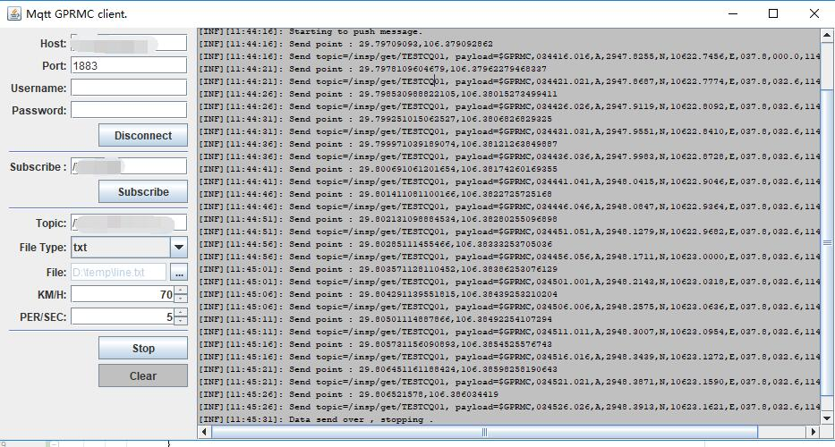

# mqtt-gprmc
A mqtt client to publish gprmc data .



## TODO
- [x] Support txt file
- [ ] Support kml file
- [ ] support wkt file

## Requirement

- jdk 1.8 +

## How to build

```bash
gradle build -x
```

## How to start

```bash
java -jar build/libs/mqtt-gprmc.jar
```

## Data example

- txt : line with  `latitude,longitude` 
```
29.79709093,106.379092862
29.806521578,106.386034419
...
```

## Related knowledge

```
$GPRMC,<1>,<2>,<3>,<4>,<5>,<6>,<7>,<8>,<9>,<10>,<11>,<12>*hh
<1> UTC时间，hhmmss.sss(时分秒.毫秒)格式
<2> 定位状态，A=有效定位，V=无效定位
<3> 纬度ddmm.mmmm(度分)格式(前面的0也将被传输)
<4> 纬度半球N(北半球)或S(南半球)
<5> 经度dddmm.mmmm(度分)格式(前面的0也将被传输)
<6> 经度半球E(东经)或W(西经)
<7> 地面速率(000.0~999.9节，前面的0也将被传输)
<8> 地面航向(000.0~359.9度，以正北为参考基准，前面的0也将被传输)
<9> UTC日期，ddmmyy(日月年)格式
<10> 磁偏角(000.0~180.0度，前面的0也将被传输)
<11> 磁偏角方向，E(东)或W(西)
<12> 模式指示(仅NMEA0183 3.00版本输出，A=自主定位，D=差分，E=估算，N=数据无效)
*后hh为$到*所有字符的异或(^)和(16进制)
```
